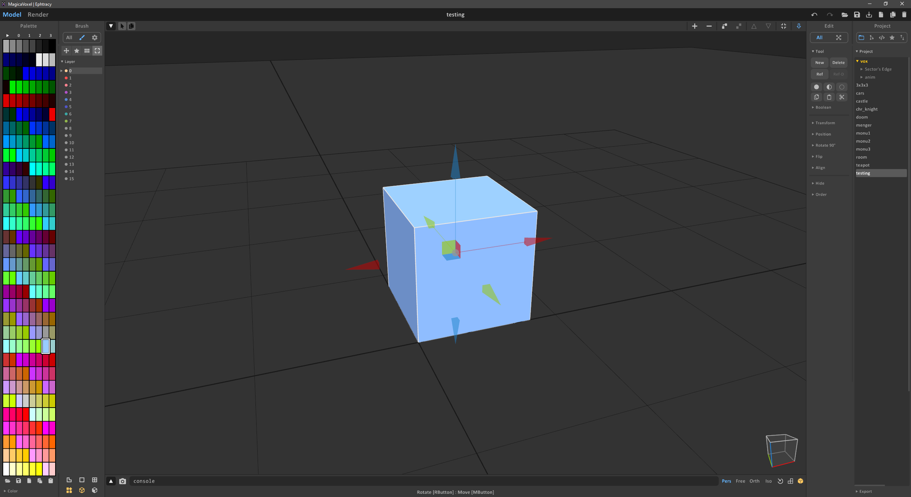
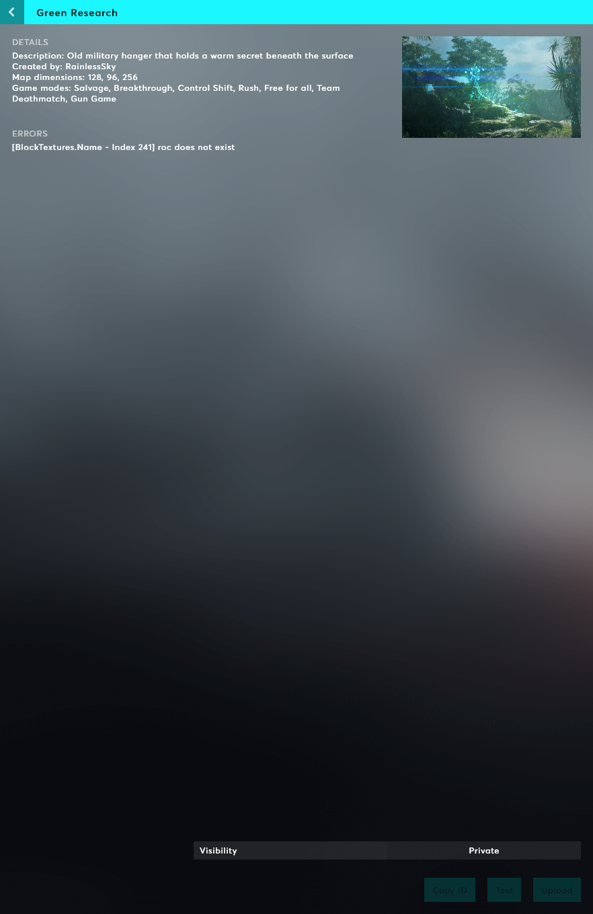
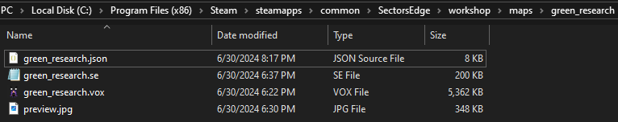

<!-- 
 -->
# GETTING STARTED

## REQUIREMENTS

The first step is to download the voxel editor [MagicaVoxel](https://ephtracy.github.io/). That's it!

## Preparing maps

The corner of your map must be aligned with the center of the grid in MagicaVoxel, with the green arrow pointing upwards and the red arrow pointing to the right:

<figure>
    
    <figcaption>Top-down view of a map</figcaption>
</figure>
 
## Testing maps

To play a map in-game, go to `Play → Singleplayer` and click on the folder icon to the right of the search bar. This will open the workshop folder.

Create a new folder and give it a name, then place your `.vox` file in it.

Maps must also have an accompanying `.json` file, which contains metadata for textures, lights, spawn regions, etc. [map_template.json](/map_template.json) file is the template file listed below.

<figure>
    
    <figcaption>In-game workshop folder icon</figcaption>
</figure>

If there are any errors or missing fields in your `json` metadata file, they will appear in game on the map list. Clicking the refresh icon will cause all files to be reloaded and the error list will update.

<figure>
    
    <figcaption>JSON errors</figcaption>
</figure>

## Uploading maps

To upload a map folder to the workshop, it must have a `.json`, `.vox` and `preview.jpg` file. The `preview.jpg` file should be a screenshot you've taken of your map.

<figure>
    
    <figcaption>Map folder example</figcaption>
</figure>

When you have these files ready, the **upload** button will light up. Select a visibility (private, friends only, public) and then click the upload button.

<figure>
    
    <figcaption>Upload button</figcaption>
</figure>

Note that each map file can be changed after your map is uploaded to the workshop. To re-upload your map, simply click the upload button again.

## Create your first map

Download these template files and place them in the `/workshop/maps/myFirstMap` folder:

* [map_template.vox](/map_template.vox) (dead)
* [map_template.json](/map_template.json) (dead) 